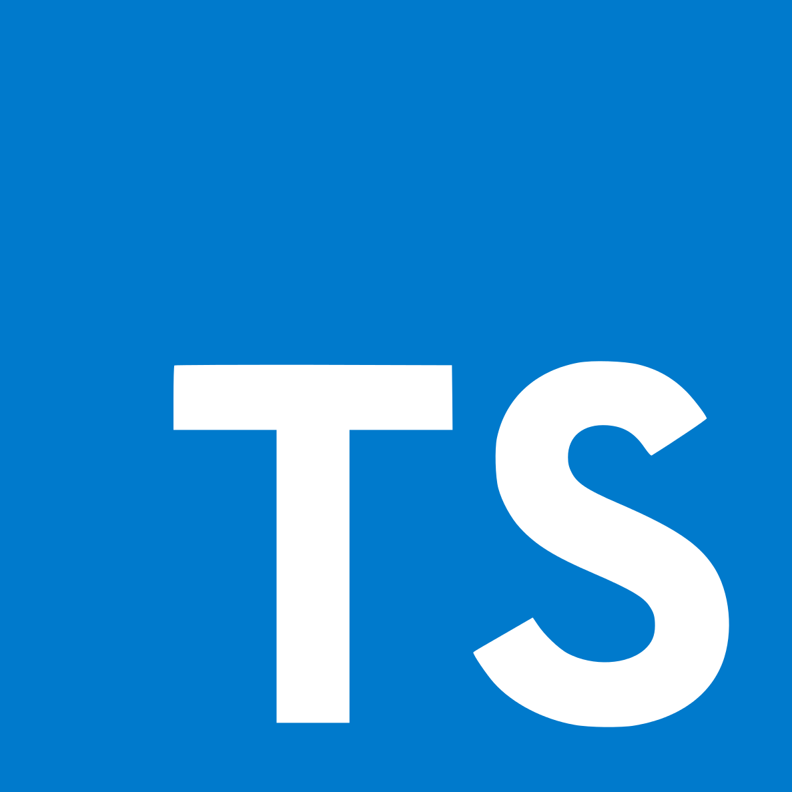

<h1 align="center">TypeScript</h1>

<p align="center">

</p>

<p>TypeScript é uma linguagem de programação de código aberto desenvolvida pela Microsoft e lançada em 2012. O nome "TypeScript" é derivado do fato de que a linguagem adiciona recursos de tipagem estática ao JavaScript, permitindo que os desenvolvedores especifiquem o tipo de dados das variáveis em seus programas. Ela é um superset da linguagem JavaScript, o que significa que pode ser usado como uma extensão da sintaxe do JavaScript para torná-la mais forte e segura, adicionando recursos como tipagem estática e outras características orientadas a objetos.</p>

## 📚 Índice

+ [Para que serve?](#🧰-para-que-serve)
+ [Instalação](#💻-instalação)
+ [VSCode](#🔧-vscode)
+ [Online Code](#🌐-online-code)
+ [Guia de estudo](#📖-guia-de-estudo)
+ [Ferramentas e bibliotecas](#🛠️-ferramentas-e-bibliotecas)
+ [Projetos  populares](#🚀-projetos-populares)
+ [Comunidade](#👥-comunidade)
+ [Créditos](#👨🏽‍💼-créditos)

## 🧰 Para que serve?

<p>O TypeScript é uma linguagem de programação versátil que pode ser usada em várias áreas, essas são algumas das áreas em que podemos usar o TypeScript:</p>

+ <strong>Desenvolvimento web:</strong> TypeScript é frequentemente usado para desenvolvimento de aplicativos da Web, incluindo sites e aplicativos web complexos. O Angular, React e Vue.js são alguns dos frameworks web populares que usam TypeScript.

+ <strong>Desenvolvimento Mobile:</strong> O TypeScript pode ser usado em desenvolvimento móvel, especialmente em conjunto com o framework Ionic, que permite o desenvolvimento de aplicativos móveis híbridos com o uso de web technologies como HTML, CSS e JavaScript.

+ <strong>Desenvolvimento de Desktop:</strong> O TypeScript pode ser usado para desenvolvimento de aplicativos de desktop, como o uso do Electron que permite criar aplicativos desktop multiplataforma usando tecnologias da web.

+ <strong>Desenvolvimento de Jogos:</strong> O TypeScript também pode ser usado para desenvolvimento de jogos. O framework Phaser é um exemplo de framework de jogos que permite o uso de TypeScript.

+ <strong>Internet das Coisas (IoT):</strong> O TypeScript também pode ser usado para desenvolvimento de soluções IoT. O Arduino, por exemplo, suporta o uso de TypeScript para desenvolvimento de aplicações.

> Em resumo, o TypeScript é uma linguagem de programação moderna, que traz benefícios como segurança, tipagem estática, melhorias na sintaxe, entre outros recursos que ajudam no desenvolvimento de aplicações complexas.

## 💻 Instalação

<p>O TypeScript pode ser instalado em qualquer sistema operacional que suporte o Node.js. Para instalar o TypeScript, primeiro é necessário instalar o Node.js em seu sistema.</p>
<p>O Node.js é um ambiente de tempo de execução de código aberto que permite a execução de JavaScript fora do navegador, no servidor ou na linha de comando.</p>
<strong>Esta instalação é válida para o Windows, Linux e macOS.</strong>


1. <p>Instale o Node.js acessando o <a href="" target="_blank">site oficial</a> e escolher a versão correspondente ao seu sistema operacional.</p>

Para verificar a instalação do node, abra o seu prompt de comando e digite:

```prompt
node –v
```

> Isso imprimirá a versão do Node instalada em seu sistema.

2. Depois de instalar e verificar o Node.js, digite o seguinte comando para instalar o TypeScript globalmente:

```
npm install -g typescript
```
3. Verifique se a instalação foi bem-sucedida. Basta digitar o seguinte comando no terminal:

```
tsc --version
```

> Isso imprimirá a versão do TypeScript instalada em seu sistema.

Com o TypeScript instalado, agora é possível criar projetos TypeScript e compilar arquivos TypeScript em JavaScript para executá-los em um ambiente Node.js ou em um navegador da web.

## 🔧 VSCode

Tendo o TypeScript instalado na sua máquina, para programar no Visual Studio Code, siga os seguintes passos:

1. Inicie o VS Code e crie um novo projeto ou abra um existente.

2. Crie um arquivo <strong>tsconfig.json</strong> na raiz do projeto e adicione as seguintes linhas:

```json
{
  "compilerOptions": {
    "target": "es6",
    "module": "commonjs",
    "sourceMap": true
  },
  "include": ["src/**/*"]
}
```

> Este arquivo pode ser criado automáticamente.
> Para criar o arquivo tsconfig.json automaticamente em um projeto TypeScript, você pode executar o seguinte comando no terminal, dentro da pasta do seu projeto:
> 

```
tsc --init
```
> Esse comando irá gerar um arquivo tsconfig.json com as configurações padrão do TypeScript. Você pode então editar esse arquivo conforme necessário para atender às necessidades específicas do seu projeto.

3. Crie uma pasta <strong>src</strong> e lá crie o seu arquivos TypeScript (com a extensão .ts) na pasta do seu projeto e o VS Code os reconhecerá automaticamente.

4. Para compilar o código TypeScript em JavaScript, basta abrir o terminal no VS Code e digitar o comando 'tsc'. Isso irá compilar todos os arquivos TypeScript na pasta 'src' em arquivos JavaScript na pasta 'dist'.

> Com essas etapas, você deve estar pronto para começar a programar em TypeScript no VS Code!

## 🌐 Online code

<p>Existem vários editores de TypeScript online disponíveis, cada um com suas próprias vantagens e desvantagens. Alguns dos editores mais populares são:</p>

+ <a href="https://www.typescriptlang.org/play/" target="_blank">TypeScript Playground</a> 
+ <a href="https://replit.com/languages/typescript" target="_blank">Repl.it</a>
+ <a href="https://codesandbox.io/" target="_blank">CodeSandbox</a>

## 📖 Guia de estudo

Existem muitos recursos disponíveis para quem deseja aprender TypeScript, incluindo a <a href="https://www.typescriptlang.org/pt/docs/" target="_blank">documentação oficial</a>, tutoriais em vídeo e cursos on-line.

Se você é um iniciante em TypeScript, aqui está um índice sugerido de tópicos de estudo:

<strong>Introdução ao TypeScript</strong>
+	O que é TypeScript
+	Principais recursos e benefícios do TypeScript
+	Diferenças entre TypeScript e JavaScript

<strong>Sintaxe Básica</strong>
+	Variáveis e tipos de dados básicos (number, string, boolean)
+	Arrays e tuplas
+	Enumerações (enums)
+	Funções e tipos de função
+	Interfaces


<strong>Programação Orientada a Objeto (POO) em TypeScript</strong>
+	Classes e propriedades
+	Métodos e construtores
+	Herança e polimorfismo
+	Modificadores de acesso


<strong>Avançando no TypeScript</strong>
+	Tipos genéricos
+	Union Types
+	Type Aliases
+	Namespaces e módulos
+	Decorators

<strong>Bibliotecas e Frameworks em TypeScript</strong>
+	Angular
+	React
+	Vue.js

<strong>Testando em TypeScript</strong>
+	Testes unitários com Jest

<strong>Empacotamento e compilação</strong>
+	Empacotando com Webpack
+	Compilando com tsc (TypeScript Compiler)

<strong>Melhores práticas de programação em TypeScript</strong>
+	Utilizando os tipos de dados corretamente
+	Evitando o any type
+	Escrevendo código legível e sustentável


<strong>Recursos adicionais</strong>
+	TypeScript Playground
+	Comunidade TypeScript
+	Livros e cursos recomendados

Este é apenas um guia básico para iniciantes. À medida que você progride em seus estudos, você pode explorar outros tópicos mais avançados, bibliotecas e ferramentas que melhor se adaptem às suas necessidades. Boa sorte!

## 🛠️  Ferramentas e bibliotecas

Existem várias ferramentas e bibliotecas disponíveis para desenvolvimento com TypeScript. Aqui estão algumas delas, separadas por áreas:

<strong>Frameworks Web</strong>

+ Angular: é um framework web para desenvolvimento de aplicações SPA (Single Page Application) que utiliza TypeScript como sua linguagem principal.
+ React: é uma biblioteca JavaScript para construção de interfaces de usuário que pode ser usada em conjunto com TypeScript para tornar o desenvolvimento mais seguro e escalável.
+	Vue.js: é um framework JavaScript para construção de interfaces de usuário progressivas e é compatível com TypeScript.

<strong>Bibliotecas</strong>
+	Lodash: é uma biblioteca JavaScript de utilitários que fornece funções para manipulação de arrays, objetos, strings, entre outros, e possui tipos para TypeScript.
+	Axios: é uma biblioteca JavaScript para realizar requisições HTTP que também possui tipos para TypeScript.
+	Moment.js: é uma biblioteca JavaScript para manipulação de datas e horários que possui tipos para TypeScript.
+	TypeORM: é uma biblioteca JavaScript/TypeScript para mapeamento objeto-relacional (ORM) que pode ser usada com vários bancos de dados.

Essas são apenas algumas das ferramentas e bibliotecas disponíveis para desenvolvimento com TypeScript. Há muitas outras disponíveis e você pode escolher aquelas que melhor atendem às suas necessidades específicas.

## 🚀 Projetos populares

Veja uma lista com alguns projectos famosos que usam ou podem usar TypeScript em seu código:

+ <a href="https://soundcloud.com/" target="_blank">SoundCloud</a> - uma plataforma de compartilhamento de música que usa TypeScript em algumas partes do seu código front-end.

+ <a href="https://pt.airbnb.com/?_set_bev_on_new_domain=1680617876_NzllMzc0ZDlhZTVi" target="_blank">Airbnb</a> - o Airbnb usa TypeScript em grande parte de seu código, incluindo em sua plataforma web e em suas ferramentas de desenvolvimento interno.

+ <a href="https://pt.wix.com/" target="_blank">Wix</a> - plataforma de criação de sites. Wix usa TypeScript em grande parte de seu código front-end e back-end.

+ <a href="https://www.microsoft.com/pt-br/microsoft-teams/log-in" target="_blank">Microsoft Teams</a> - o Microsoft Teams, uma plataforma de comunicação empresarial, é construído com TypeScript.

+ <a href="https://asana.com/pt" target="_blank">Asana</a> - a plataforma de gerenciamento de tarefas Asana usa TypeScript em seu front-end e back-end.

## 👥 Comunidade

A comunidade TypeScript também é bastante ativa e crescente, especialmente desde que a linguagem foi lançada pela Microsoft em 2012. A comunidade TypeScript é composta por desenvolvedores, usuários e entusiastas de todo o mundo, que colaboram em projetos de código aberto e contribuem para o desenvolvimento da linguagem e de suas ferramentas.


Aqui estão alguns links para a comunidade TypeScript no GitHub:

+ Repositório oficial do TypeScript: https://github.com/microsoft/TypeScript

+ TypeScript Handbook: https://github.com/microsoft/TypeScript-Handbook

+ Awesome TypeScript: https://github.com/dzharii/awesome-typescript

Aqui estão os links dos perfis do Twitter relacionados a TypeScript:

+ <a href="https://twitter.com/typescript" target="_blank">@typescript</a> 

+ <a href="https://twitter.com/ryan_cavanaugh" target="_blank">@ryan_cavanaugh</a> 

+ <a href="https://twitter.com/ahejlsberg" target="_blank">ahejlsberg</a>

## 👨🏽‍💼 Créditos

<p>Este repositório foi inicialmente criado pelo Otoniel Emanuel, um estudante de programação e apaixonado por tecnologia. Obviamente com o crescimento da repositório, outras pessoas também daram as suas contribuições.</p>

### 📱 Redes sociais

+ <a href="https://www.linkedin.com/in/otoniel-emanuel-b80727261/" target="_blank">LinkedIn</a>
+ <a href="https://www.instagram.com/eusouootis_" target="_blank">Instagram</a>


